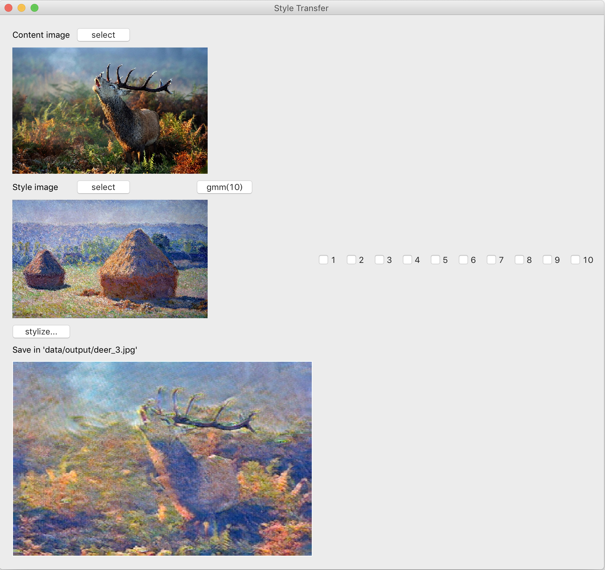
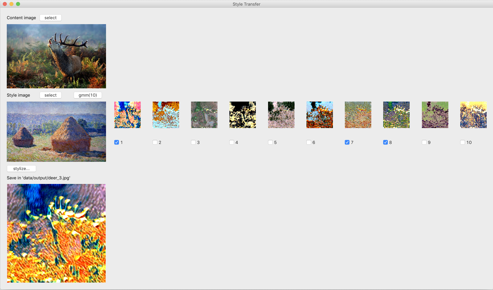

# StyleBank
Implementation of the paper - [StyleBank: An Explicit Representation for Neural Image Style Transfer](https://arxiv.org/abs/1703.09210)  

Code Reference : [Stylebank](https://github.com/jxcodetw/Stylebank), [CNN Visualization](https://github.com/utkuozbulak/pytorch-cnn-visualizations)

## Requirements
Python 3.6 or later with the following `pip3 install -U -r requirements.txt` packages:  
* numpy
* torch >= 1.0.0
* torchvision

## Introducion
It is one method of the **Style Transfer** based on Convolutional Neural Network, also named as **Neural Style Transfer**.  
Compared to the first Neural Style Transfer ([Gatys, 2015](https://www.cv-foundation.org/openaccess/content_cvpr_2016/papers/Gatys_Image_Style_Transfer_CVPR_2016_paper.pdf)), it's more conventient.  
1. TransferNet  
(no need to train every time if have trained this style before)
2. Incremental Learning
3. Style and Content is seperable

## Description
### Architecture

 

- **Input**  
using random 1000 pics from MS-COCO datasets as content image dataset, and 16 kinds of art painting from Wiki-Art as style image dataset.

- **Network and Training**  
having two part. Each part has each corresponding training branch.  
  1. Auto-encoder : encoder and decoder. 
  

  2. StyleBank Layer: style filter. 
  

- **Training Strategy**  
Employ a (T+1)-step alternative training strategy in order to balance the two branches (auto-encoder and stylizing). During training, for every T+1 iterations, we first train T iterations on the stylizing branch , then train one iteration for auto-encoder branch.

- **Parameters**  
Image size : 512 x 512  
Content weight: 1, Style weight: 1000000  
T: 2
Learning rate: 0.001, Learning rate decay: decayed by 0.8 at every 30k iterations. 
Iteration : 300,000

## Training
Prepare the content image dataset ([MS-COCO](http://cocodataset.org/#download)), and your style image dataset.  
`python train.py`  
It takes about 2 days to train on GeForce GTX 2080 Ti.  

Pre-trained weights are provied.  You can do **Incremental Learning**. Just load the pre-trained  encoder and decoder, then train the stylebank which style image you want. 
`python train_add.py`

## GUI
`python gui.py`  

### 1. Use whole style to do style transfer 
**Step1. Select Content Image**  
**Step2. Select Style Image**  
**Step3. Click 'Stylize...' Button**  
<text color='gray'>[ Result ]</text> 

### 2. Choose some style elements to do style transfer 
**Step1. Select Content Image**  
**Step2. Select Style Image**  
**Step3. Click 'gmm(10)' Button** 
Wait a monent, it will show 1~10 style elements. Choose some style elements you like. 
**Step4. Click 'Stylize...' Button**  
<text color='gray'>[ Result ]</text> 

 

## Examples
Style | Content | Stylized
:--:|:--:|:--:
 |  | 
 |  | 
 |  | 
 |  | 

## Future
- [ ] content control
- [ ] mobile app
- [ ] show visualizing results
- [ ] explain test.py